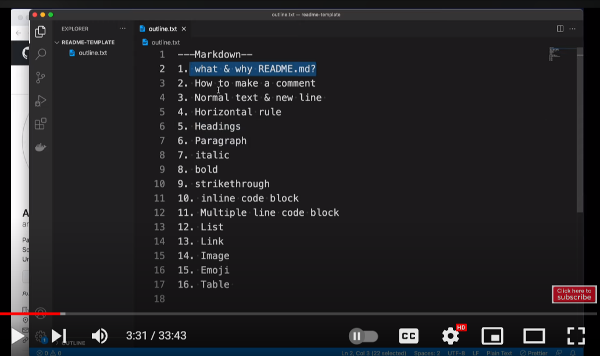

# 👋Welcome to my tutorial

### .md means markdown documents.

---
  
   > `>` sign is used for quote.
  >> `>>` is used for  nested quote.

     

 <!--    "  > " is used for quotes     -->

---

- ### Image Link:
```
  
```
```
  HTML :  
```



---
- ### Adding link:
  - Automatic Link :
         www.facebook.com
  - Disable Link :
          `www.facebook.com`
  -  Markdown Link :
    
  ```markdown
  [text](www.Link.com)
      
  ```
  [Facebook](www.facebook.com "Tooltip")
  
---
- ### Italic/bold /both :
   ```
    _Italic_
    **Bold**
    __Both__
    ***Both***
   ```
  _Italic_
    **Bold**
    __Both__
    ***Both***


---

- ### List :
   - Ordered List
     
        ```
          1. one
          1. two
          1. three
        ```
        1. one       
        1. two
        1. three
         
  ---    

  - Unordered List :
    
      ```
       - Part1
       - part2
       - part3
      ```
       - Part 1
       - part 2
       - part 3
         
  ---
  
  - Task list :
    ```
     - [x] Topic 1
     - [x] Topic 2
     - [ ] Topic 3
    ```
    - [x] Topic 1
    - [x] Topic 2
    - [ ] Topic 3

---

### Table syntax: 
 ```
   | Name | Email | Comments |
   | --- | --- | --- |
   | Put your Name Here | Put email here |
   
 ```
 
   | Name | Email | Comments |
   | --- | --- | --- |
   | Abdullah Al Maruf | aamaruf2000@gmail.com |
   | Mahdi Hasan | the.madhi.hasan@gmail.com |
   | Put your Name Here | Put email here |
   
---
    
    
  
