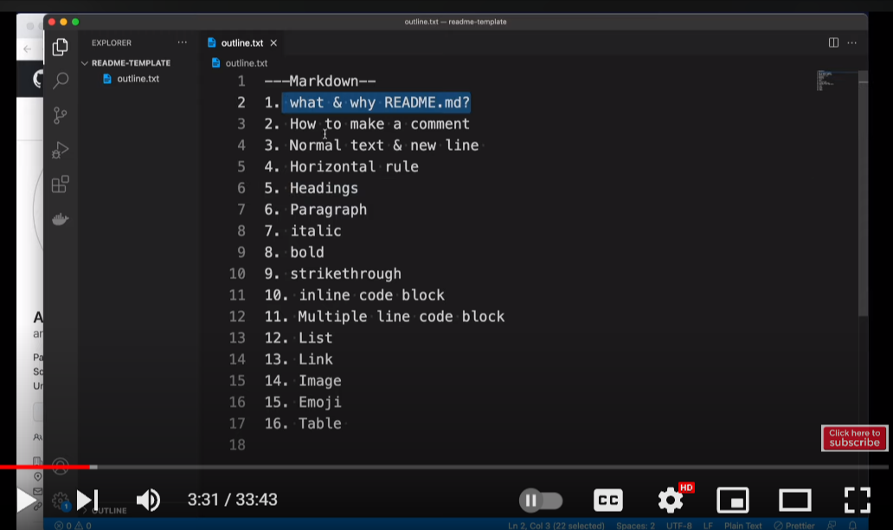

# 🖐️ Hellooo! Welcome to markdown language tutorial

## Description: 
> ###  This repl is for describing [markdown language](https://en.wikipedia.org/wiki/Markdown "Wikipedia-about mardown language") . All the information on markdown language that I know are explained here.

> #### Also this is written in markdown language too. [This is my code link](https://replit.com/@MARUF41/Replit-101-1#.tutorial "Replit Link").


> #### Note: `.md` means markdown documents.


---
## Table of Contents:
- [Quote](#quote)
- [Image](#image-link)
- [Adding link](#adding-link)
- [Italic/bold alphabet](#italicbold-both-)
- [Underline Text](#Underline-text)
- [Strikethrough](#Strikethrough)
- [List](#list)
- [Table](#table)
- [Code block](#code-block)
- [Header link](#header-link)
- [ Horizontal rule](#horizontal-rule)
---

  
 - ## <ins>Quote</ins>:
   
   > `>` sign is used for quote.
  >> `>>` is used for  nested quote.

     

 <!--    "  > " is used for quotes     -->


- ## <ins>Image Link</ins>:
```markdown
  <!--   Markdown syntax    -->
  
```
```html
 <!--   HTML syntax    -->
  
```
```c
Demo (Markdown):
```

```c
Demo (HTML):
```


- ## <ins>Adding link</ins>:
  - Automatic Link :
         `Demo:`www.facebook.com
    
    ```c
    /// Directly add Link. It will be auto genarated. 
    
     ```
    
  - Disable Link :
          `Demo:` `www.facebook.com`
  ```markdown
   <!--   Markdown syntax    -->
  /// To disable a link,write the link inside 2 backtic symbol (`)
    `www.facebook.com`
  
  ```
  -  Markdown Link :
     `Demo:` [Facebook!](www.facebook.com "Tooltip")
    
  ```markdown
  <!--   Markdown syntax    -->
     [text](www.Link.com) 
      
  ```
  
  

- ## <ins>Italic/bold / Italic & bold</ins>:
    `Demo:`
   _Italic_
    **Bold**
    __Bold__
    ***Italic & Bold***
   ```markdown
      <!--   Markdown syntax    -->
  
    _Italic_
  
    **Bold**
  
    __Bold__
  
    ***Italic & Bold***
   ```
 
- ## <ins>Strikethrough</ins>:
  `Demo: `  ~~This text is strikethrough~~
  ```markdown
  <!-- Markdown Syntax -->
      ~~This text is strikethrough~~
  ```
- ## <ins>Underline text </ins>:
  `Demo:` <ins>" This is an underlined text "</ins>

  ```markdown
  <!-- Markdown Syntax -->
   <ins> Text </ins>
  ```


- ## <ins>List</ins>:
   - Ordered List
     
        ```markdown
         <!--   Markdown syntax    -->
          1. one
          1. two
          1. three
        ```
     `Demo:`
        1. one       
        1. two
        1. three
         
  
  
  - Unordered List :
    
      ```markdown
     <!--   Markdown syntax    -->
       - Part1
       - part2
       - part3
      ```
      `Demo:`
       - Part 1
       - part 2
       - part 3
         
  

  - Task list :
    ```markdown
      <!--   Markdown syntax    -->
     - [x] Topic 1
     - [x] Topic 2
     - [ ] Topic 3
    ```
    `Demo:`
    - [x] Topic 1
    - [x] Topic 2
    - [ ] Topic 3


- ## <ins>Table</ins>: 
 ```markdown
    <!--   Markdown syntax    -->
    
   | Name | Email | Comments |
   | --- | --- | --- |
   | Put your Name Here | Put email here |
   
 ```
 `Demo:`
   | Name | Email | Comments |
   | --- | --- | --- |
   | Abdullah Al Maruf | aamaruf2000@gmail.com |
   | Mahdi Hasan | the.madhi.hasan@gmail.com |
   | Put your Name Here | Put email here |
   


- ## <ins>Code block</ins>:
  
  
   - Inline code block: Demo -> `Syntax`
     ```markdown
       <!--   Markdown syntax    -->
     
       `Syntax`  ///write code inside 2 backtick symbol
     ```


  - Multiple Line code block:</p>
    `Demo:`
      ```c
          ///Demo:
          #include<stdio.h>
            void main(){
            printf("Hello world\n");
            }
      ```
    
    ```markdown
     <!--   Markdown syntax    -->
    ```c
       ///starting with 3 backtick+             programming language name (optional)
  
         code
  
    ```  ///ending with 3  backtick

    ```


- ## <ins>Header Link</ins>:


    `Demo :` Clicking on [Table of Contents](#table-of-contents) will take you to the "Table of contents" header of this page.
  ```Markdown
  <!--   Markdown syntax    -->
     [Text](#Header-file-name)
  ///For space inside header file name,use hyphen.
  Example:
    [Table of contents](#table-of-contents)
    
  ```


- ## <ins>Horizontal rule</ins>:


  ```markdown
  <!--   Markdown syntax    -->
  ---
          Hello
  ---
  ```


---

### Thank you 🙂

